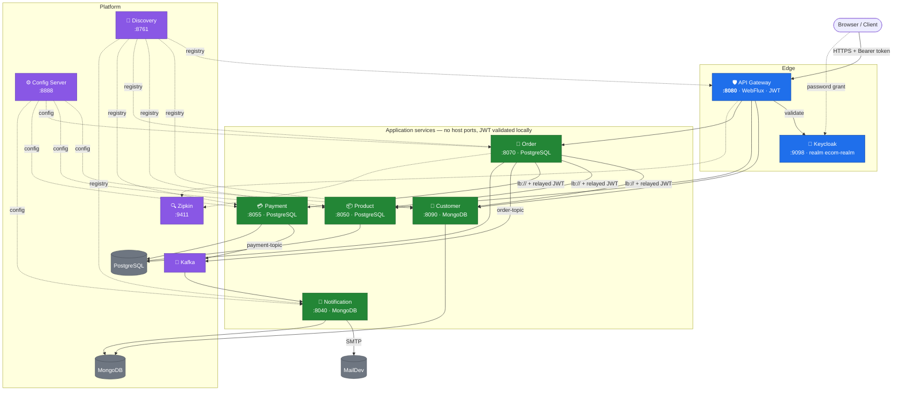
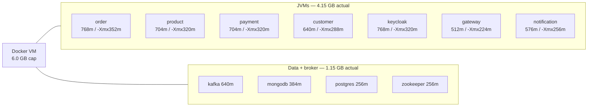

<div align="center">

# 🛒 Ecommerce Microservices

### Production-shaped Spring Boot microservices with JWT auth, Kafka events and Zipkin tracing

[](https://adoptium.net/)
[](https://spring.io/projects/spring-boot)
[](https://spring.io/projects/spring-cloud)
[](https://www.docker.com/)
[](https://kafka.apache.org/)
[](https://www.keycloak.org/)
[](https://www.postgresql.org/)
[](https://www.mongodb.com/)
[](https://zipkin.io/)
[](https://maven.apache.org/)

**8 services** · **JWT validated in every service** · **17 containers, all memory-capped**

</div>

---

## 📋 What's in here

| | |
|---|---|
| 🔐 **Security** | Keycloak JWT validated by the gateway **and** by all five business services. Realm roles mapped to `ROLE_*`. Owner-scoped customer data, admin-only catalog and listing. |
| 💰 **Correctness** | The server generates the order id, computes the total from product prices and resolves the customer from the token. Clients cannot set any of the three. |
| 📦 **Stock** | Atomic conditional updates so concurrent orders cannot oversell, with compensating release when an order fails after reserving. |
| 🧠 **Resilience** | Circuit breakers that treat an out-of-stock rejection as normal business rather than an outage. |
| 📊 **Observability** | Zipkin traces spanning gateway → order → customer → product → payment, plus Actuator health on every JVM service. |
| 🐳 **Operations** | Every container memory-capped, every JVM heap pinned, every service started and health-gated in dependency order. |

---

## 🏗️ Architecture



**Only the gateway and the platform publish host ports.** The five business services listen on
container-internal ports and validate the JWT themselves, so anything that reaches them on the
Docker network cannot skip authorization.

<details>
<summary><b>📡 How order calls the other services</b></summary>

`order` calls `customer`, `product` and `payment` **directly through Eureka**
(`lb://product-service`, …) with `RestTemplate` — *not* through the gateway, and *not* with Feign.

- Each call copies the inbound `Authorization` header onto the outbound request, so the
  downstream service authorizes the **real end user** rather than a shared service identity.
- Timeouts live in `order-service.yml` under `application.config.feign.*`. The key name is
  historical; the clients are `RestTemplate` beans but the timeout properties are still read
  from there. The JWT relay interceptor is in `config/RestTemplateConfig.java`.
- The trace context is injected too, so one trace spans the whole order.
</details>

---

## 🚀 Services

| Service | Port | Database | Role |
|---|:---:|---|---|
| `config-server` | 8888 | — | Centralized configuration for every service |
| `discovery` | 8761 | — | Eureka registry |
| `api-gateway` | 8080 | — | Reactive gateway, JWT validation, load-balanced routing |
| `customer` | 8090 | MongoDB | Profile CRUD, bound to the Keycloak subject |
| `product` | 8050 | PostgreSQL | Catalog, stock reservation and release |
| `order` | 8070 | PostgreSQL | Order creation; orchestrates customer, product, payment |
| `payement` | 8055 | PostgreSQL | Payment processing, publishes payment confirmations |
| `notification` | 8040 | MongoDB | Consumes Kafka events, sends email via SMTP |

<details>
<summary>Published host ports</summary>

`api-gateway` 8080 · `config-server` 8888 · `discovery` 8761 · `keycloak` 9098 ·
`postgres` 5433 · `mongodb` 27017 · `kafka` 9092 · `zookeeper` 2181 · `zipkin` 9411 ·
`maildev` 1080 / 1025 · `pgadmin` 5000 · `mongo-express` 8081

Customer, product, order, payment and notification expose **no** host port.
</details>

> The payment service directory is spelled `payement` in this repository.

---

## 🧮 Memory

> [!IMPORTANT]
> **This is the main operational constraint of the project.**
> Docker Desktop runs in a VM, and on a 16 GB host that VM is typically capped at **6 GB** while
> `qemu-system-x86` alone occupies ~4.3 GB of host RAM. This stack runs **nine JVMs**.

Every one of the 17 containers has a `mem_limit`, and every JVM has an explicit `-Xmx` rather
than a percentage of the machine:



| Metric | Before | After |
|---|---:|---:|
| Memory in use | 4.59 GB | **4.00 GB** |
| Headroom under the 6 GB cap | 1.3 GB | **2.0 GB** |
| Containers with no limit | 12 | **0** |
| `Exited (137)` in one cascade | 8 | **0** |

<details>
<summary><b>⚠️ Why a percentage heap was the real bug</b></summary>

`-XX:MaxRAMPercentage=60` is resolved against whatever the JVM believes the machine has.
**With no `mem_limit`, that is the entire Docker VM** — so `api-gateway`, `config-server` and
`discovery` were each willing to take a 3.6 GB heap, and `-XX:InitialRAMPercentage=60` meant
they *committed* all of it at boot. Four such JVMs plus five capped ones overran the VM and the
kernel started killing containers.

Two rules now hold:

1. **`mem_limit` above `heap + metaspace + code cache + ~20%`** for thread stacks and direct buffers.
2. **Explicit `-Xmx`, `-XX:MaxMetaspaceSize`, `-XX:ReservedCodeCacheSize`** in each dockerfile,
   so the numbers are identical on every host and cannot drift.

`keycloak` has no dockerfile of ours, so its heap is bounded with `JAVA_OPTS` in compose instead.
`+ExitOnOutOfMemoryError` is kept everywhere: better a fast restart than a thrashing container.
</details>

---

## 🔐 Security

Keycloak runs in `start-dev` with the realm in `services/keycloak/realm-export.json` mounted at
`/opt/keycloak/data/import`, so the realm exists on first boot.

<details>
<summary><b>👥 Test users</b></summary>

| User | Password | Roles |
|---|---|---|
| `user` | `user123` | `USER` |
| `admin` | `admin123` | `ADMIN`, `USER` |

Access tokens expire after **1800 seconds**. A 401 long after a successful call is expiry, not a
configuration fault. Direct access grants are for local testing only — password grants are
deprecated and should be replaced with authorization code + PKCE for a browser client.
</details>

### Gateway authorization

| Path | Access | Result |
|---|---|:---:|
| `GET /api/v1/products/**` | Public | ✅ `200` |
| `POST /api/v1/products/purchase/release` | **Denied to everyone** | ✅ `403` |
| `GET /api/v1/customers` (list) | `ADMIN` | ✅ `USER` → `403`, `ADMIN` → `200` |
| `DELETE /api/v1/customers/**` | `ADMIN` | ✅ `204` |
| `POST /api/v1/products` | `ADMIN` | ✅ `USER` → `403` |
| `POST /api/v1/customers`, `PUT /api/v1/customers/**` | Authenticated | ✅ anon → `401` |
| Everything else | Authenticated | ✅ anon → `401` |

<details>
<summary><b>🚫 Why the stock-release endpoint is denied outright</b></summary>

`POST /api/v1/products/purchase/release` is the compensation endpoint `order` calls when an
order is rolled back. It is reachable inside the container network, so the gateway denies it —
**without that rule any authenticated user could call it and inflate stock at will.** One such
call took a product from 4 to 54 units in testing.

It returns `403` for `USER`, `403` for `ADMIN` and `401` anonymously. Service-to-service calls
bypass the gateway, so order placement is unaffected.

Restricting it *properly* needs a service identity (client credentials with its own scope)
rather than the end user's relayed token — see the *Known issues* section at the end of this file.
</details>

### Inside the services

The gateway is a convenience, not the security boundary. Every service re-checks:

- **product** — only `GET`s and the health probe are public; all mutations need a token.
- **customer** — a profile is owned by the Keycloak subject (`keycloakId`, sparse-unique).
  Reads and updates are owner-only: `GET /{id}` and `/exists/{id}` return `403` for another
  subject even though the caller is authenticated. Listing and deleting need `ADMIN`.
- **order** — queries are scoped to the authenticated customer's own orders.
- **payment** — requires a token; the client cannot choose its own id or amount.

<details>
<summary><b>🔑 The Keycloak issuer split</b></summary>

Services fetch signing keys over the Docker network but validate the issuer against the
**host-visible** URL, because tokens minted from the host carry the external `iss` claim:

```yaml
spring.security.oauth2.resourceserver.jwt.jwk-set-uri: http://keycloak:8080/realms/ecom-realm/protocol/openid-connect/certs
keycloak.issuer-uri: http://localhost:9098/realms/ecom-realm
```

This needs an explicit `JwtDecoder` bean; `Customizer.withDefaults()` cannot express the split.
Realm roles from `realm_access.roles` are mapped to `ROLE_*` authorities by a
`JwtAuthenticationConverter` that each service declares itself.
</details>

---

## ⚙️ Configuration

Copy `.env.example` to `.env` and set the values. `.env` is gitignored.

| Variable | Purpose |
|---|---|
| `POSTGRES_USER` / `POSTGRES_PASSWORD` | PostgreSQL for product, order, payment |
| `MONGO_USER` / `MONGO_PASSWORD` | MongoDB for customer, notification |
| `MAIL_USER` / `MAIL_PASSWORD` | SMTP (left empty for MailDev) |
| `KEYCLOAK_ADMIN` / `KEYCLOAK_ADMIN_PASSWORD` | Keycloak bootstrap admin |

Configuration lives in `services/config-server/src/main/resources/configurations/`, keyed by
application name. There is **no aggregator POM** — build each service from its own directory.

<details>
<summary><b>💥 Circuit breakers and the allowlist trap</b></summary>

A rejected purchase (out of stock, invalid payload) is normal business behaviour, **not** an
outage, so `productService` ignores it:

```yaml
resilience4j.circuitbreaker.instances.productService:
    ignore-exceptions:
        - com.younes.order.exception.ProductPurchaseRejectedException
```

Do **not** add `record-exceptions` here. `record-exceptions` is an *allowlist* that overrides
`ignore-exceptions`, and because the rejection type extends `BusinessException`, listing that
supertype records the rejections again. The breaker then opens after ten failed orders and every
later order fails with *"product service is currently unavailable"*, hiding the real cause.
</details>

---

## ▶️ Running

```bash
cd services
docker compose up -d        # start everything
docker compose down         # stop
```

`config-server` and `discovery` gate the rest through health checks, so a full start takes
several minutes. Verify:

```bash
docker compose ps
curl -s http://localhost:8761/eureka/apps | grep -o '<name>[A-Z-]*</name>'
```

<details>
<summary><b>🔁 Rebuilding after a change</b></summary>

Images copy `target/*.jar`, so Maven must run first, and there is no aggregator POM:

```bash
(cd order && mvn clean package)
docker compose build order-service
docker compose up -d --force-recreate order-service
```

**Changing only `config-server` is the easiest mistake in this repo.** Editing a file under
`config-server/src/main/resources/configurations/` does nothing until the config-server JAR *and*
image are rebuilt **and** the dependent services are restarted — `docker compose up -d config-server`
will not restart them, because their images did not change:

```bash
(cd config-server && mvn clean package)
docker compose build config-server
docker compose up -d config-server
docker compose restart order-service payment-service
```

Confirm the change reached a running service before debugging anything else:

```bash
curl -s http://localhost:8888/order-service/default | python3 -m json.tool | grep <key>
```
</details>

### 🔑 Get a token

```bash
TOKEN=$(curl -s -X POST \
  "http://localhost:9098/realms/ecom-realm/protocol/openid-connect/token" \
  -d "client_id=ecom-frontend" -d "grant_type=password" \
  -d "username=user" -d "password=user123" |
  python3 -c "import sys,json;print(json.load(sys.stdin)['access_token'])")
```

The catalog is public:

```bash
curl http://localhost:8080/api/v1/products
```

### 🧾 Place an order

```bash
curl -X POST http://localhost:8080/api/v1/orders \
  -H "Authorization: Bearer $TOKEN" -H 'Content-Type: application/json' \
  -d '{"reference":"ORDER-1","paymentMethod":"VISA",
       "products":[{"productId":401,"quantity":2}]}'
```

`id`, `amount` and `customerId` in the body are **ignored if present**: the id is generated, the
total is computed server-side in `BigDecimal`, and the customer comes from the JWT subject. Stock
is decremented in one transaction and released back if any later step fails.

Insufficient stock returns `400` with the product service's own message, and **repeated
rejections never open the breaker** — a valid order right after still succeeds.

---

## 🧪 Tests

Each service has a context-load test; `product` adds six stock tests covering concurrent
reservation, rollback, duplicate order lines and oversell.

```bash
for s in config-server discovery api-gateway customer product order payement notification; do
  (cd $s && mvn -o clean package) || break
done
```

**15 tests total, all green.** Services use optional config-server imports, so the tests run
without the stack being up.

---

## 🔍 Email & tracing

MailDev captures mail from the notification service. Its API is reachable only from inside the
Docker network, and its own healthcheck in this project is unreliable — ignore `unhealthy` unless
a `depends_on: service_healthy` condition actually gates startup on it.

```bash
docker exec services-notification-service-1 curl -s http://maildev:1080/api/email
docker logs ms_mail_dev --since 5m | grep -A1 Received
```

Zipkin reports `customer-service`, `notification-service`, `order-service`, `payment-service`
and `product-service`:

```bash
curl -s http://localhost:9411/api/v2/services
curl -s "http://localhost:9411/api/v2/traces?serviceName=order-service&limit=10"
```

---

## ⚠️ Known issues

<details>
<summary><b>🐳 Docker memory exhaustion</b></summary>

Still the dominant operational risk. The VM is capped at 6 GB on a 16 GB host and nine JVMs are a
tight fit. Start the stack in stages — infrastructure, then catalog, then order and gateway — and
restart anything showing `Exited (137)`. If the daemon itself stops, restart Docker Desktop.
Every JVM now has a pinned heap so no single process can balloon.
</details>

<details>
<summary><b>🔑 Keycloak must keep its data volume</b></summary>

Keycloak stores its database at `/opt/keycloak/data/h2`. Without a volume it starts empty every
time, re-imports the realm and **mints new internal user ids**. Customer profiles are keyed by
that id, so each restart silently orphaned every profile and orders then failed with *"no customer
profile is associated with the authenticated user"*. The volume is declared in compose and
Keycloak runs as `root` because that volume is created root-owned and uid 1000 cannot write the
H2 lock file.
</details>

<details>
<summary><b>📦 Stock compensation is not durable</b></summary>

When an order fails after stock was reserved, the release call has a circuit breaker and a
fallback, but there is **no retry queue or outbox**. If the release itself fails, the fallback
logs the stranded stock for manual reconciliation. A durable outbox plus a reconciler is the next
step.
</details>

<details>
<summary><b>🌐 The release endpoint is still reachable inside the network</b></summary>

The gateway denies it, but all services share one Docker network, so a compromised container
could still call it. Closing this properly needs a service identity rather than the relayed
end-user token.
</details>

<details>
<summary><b>🧾 Consumer offset errors</b></summary>

The notification service logs a deserialization error on `order-topic-0` at a stale offset when a
record predates the current event class shape. It skips the record and new records deserialize
normally; it does not block mail delivery.
</details>

<details>
<summary><b>🔍 Codes that mean authorization passed</b></summary>

A `400` with validation errors from `POST /api/v1/products`, or a `404` for a missing product,
means the request reached the service — the code comes from bean validation or a missing mapping,
not from the gateway. Check the service logs.
</details>

---

## 📁 Repository layout

```
services/
  config-server/     centralized configuration
  discovery/         Eureka server
  api-gateway/       gateway, security rules, JWT validation
  customer/          customer service
  product/           product service
  order/             order service, lb:// clients
  payement/          payment service
  notification/      Kafka consumer, email sender
  keycloak/          realm export
  init-scripts/      creates the product/order/payment databases
  docker-compose.yml
  .env               local secrets, gitignored
```

---

<div align="center">
  <sub>Built with Spring Boot 4 · Java 21 · Keycloak · Kafka · PostgreSQL · MongoDB · Zipkin</sub>
</div>